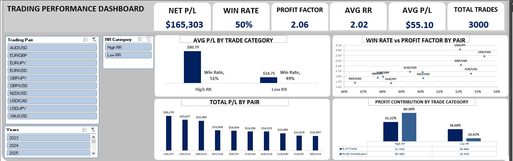
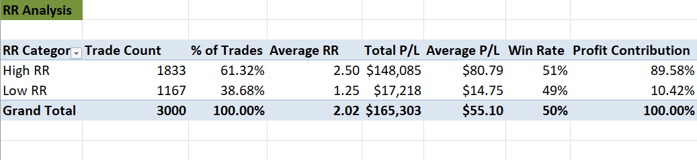
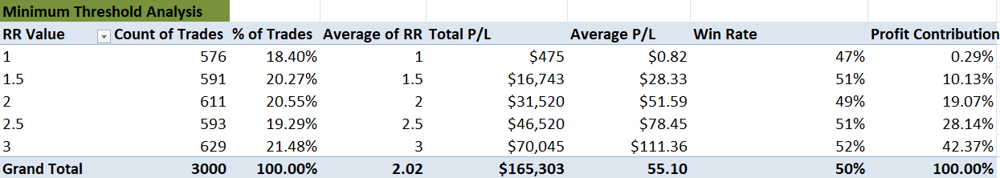
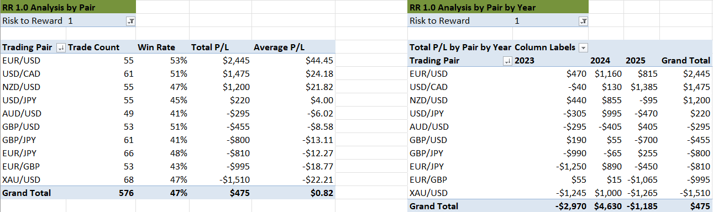
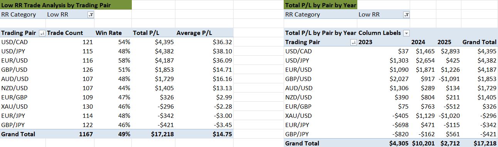

# Risk-to-Reward (RR) Trade Performance Analysis

Analysis of 3,000 trades across 3 years, identifying the exact 
Risk-to-Reward threshold where trading performance improves.

## Overview

A breakdown of 3 years of trade data by Risk-to-Reward ratio, 
moving from a simple High/Low RR split down to the exact RR 
value where performance meaningfully improves — and what's 
actually driving the weak numbers at the bottom of that range.

## Key Question

Is profitability driven by winning more often, or by winning 
bigger? And is there a specific RR threshold where performance 
meaningfully improves?

## Findings

### 1. High RR vs Low RR

High RR trades (RR ≥ 2.0) made up 61.32% of trades but generated 
89.58% of total profit, despite a win rate nearly identical to 
Low RR (51% vs 49%). The edge isn't coming from winning more 
often — it's coming from the payoff structure of the winning 
trades.

### 2. Finding the Real Threshold

Breaking RR into its exact values (1.0, 1.5, 2.0, 2.5, 3.0) 
revealed the inflection point wasn't at the Low/High RR boundary 
— it was between RR 1.0 and RR 1.5. RR 1.0 alone contributed 
just 0.29% of total profit despite being 18.4% of all trades, 
while Average P/L jumped from $0.82 at RR 1.0 to $28.33 at RR 1.5 
and kept climbing steadily through RR 3.0.

### 3. RR 1.0 — Pair and Year Breakdown

Isolating RR 1.0 trades by pair and year showed the weak average 
wasn't uniform. Some pairs were improving, some deteriorating, 
and some were simply too volatile to trust at this RR.

### 4. Low RR — Pair and Year Breakdown

Before the threshold was isolated, the broader Low RR category 
(RR < 2.0) was analyzed the same way — by pair, then by pair and 
year — to see whether underperformance was spread evenly or 
concentrated in specific markets.

## The Recommendations

1. **Exclude XAU/USD and EUR/JPY from RR 1.0 trades.** These are 
   the pairs to actually restrict — not because they're always 
   negative, but because they're too inconsistent to trade 
   reliably at this RR, regardless of the current year's result.

2. **Flag GBP/USD and EUR/GBP for immediate review, not exclusion 
   yet.** Two years of solid performance followed by one bad year 
   isn't enough to cut them outright, but the 2025 reversal needs 
   investigating before continuing to trade them at RR 1.0.

3. **Keep GBP/JPY and AUD/USD in the RR 1.0 pool.** Both are 
   trending toward profitability. Cutting them now, based on 
   their weaker 2023-2024 numbers, would mean missing pairs that 
   are actively turning around.

4. **Treat RR 1.0 as a pair-selective RR, not a blanket-avoid RR.** 
   The instinct after seeing $0.82 average P/L is to cut RR 1.0 
   entirely. The data says otherwise — several pairs are either 
   fine or improving at this RR. The fix isn't eliminating RR 1.0, 
   it's trading it only on pairs that have earned it.

*N.B. Findings are specific to RR 1.0 only. RR 1.5–3.0 were not 
part of this breakdown.*

## Tools Used

Excel (Pivot Tables, Power Pivot, Conditional Formatting)

## Note

Raw trade data and workbook are not shared publicly; this repo 
presents the analysis and findings only.
